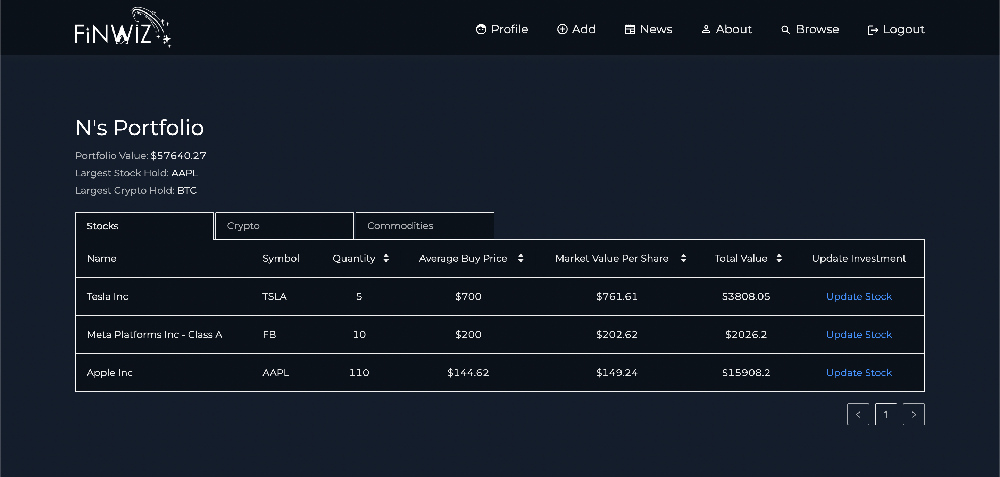
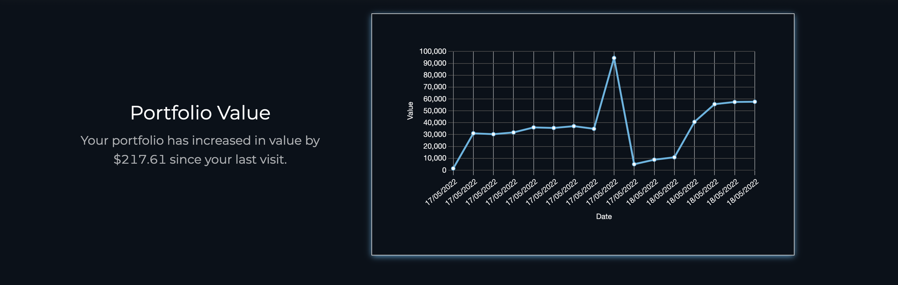
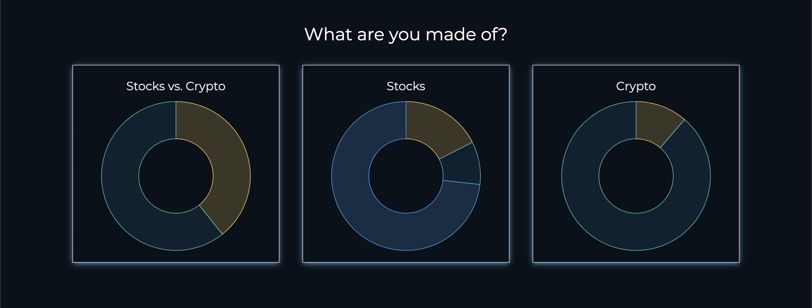
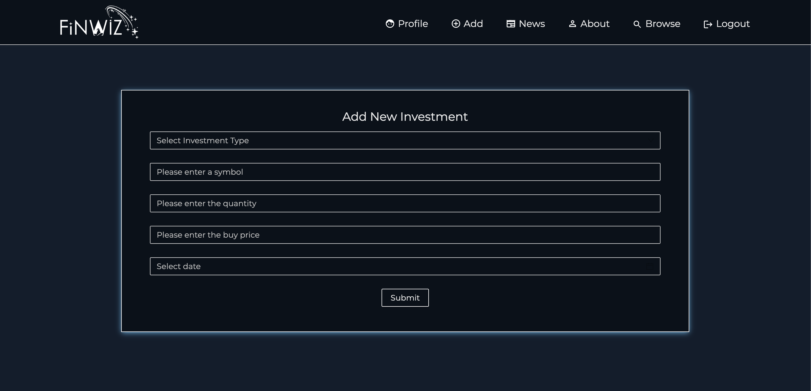
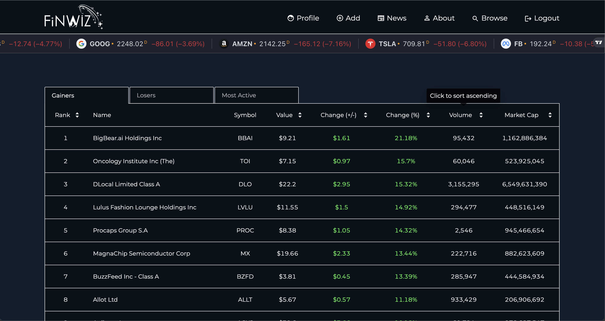
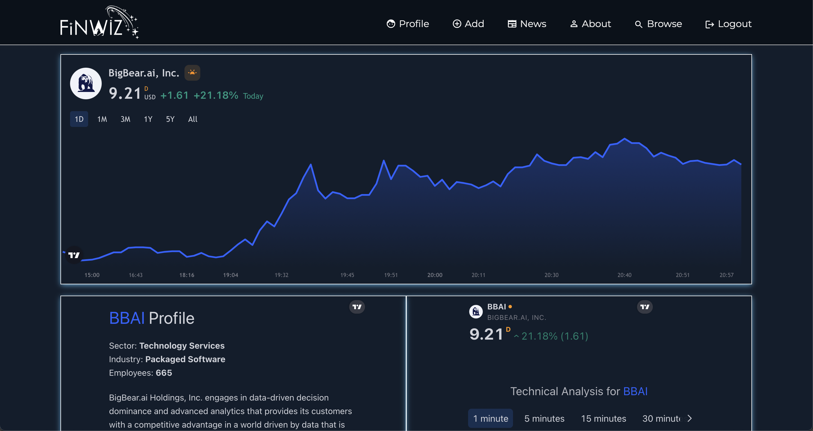

# FinWiz_client

## Overview
FinWiz is financial portfolio tracker that allows users to perform a number of tasks including:

* Browse realtime stock/crypto/commodity/forex data.
* Browse the latest market news.
* Signup/login using Auth0.
* Add and update portfolio assets.
* View portfolio stats, including largest stock/crypto holds, portfolio value over time, average buy price vs. market price, makeup of portfolio, and portfolio related news.
---

## Technologies used in the application
The following technologies were used in the client side of the application:
* React
* TypeScript
* Ant Design Components
* RTK Query
* Sass
* Chart.js
* Trading View Widgets
---

## Screenshots of FinWiz in action
Portfolio

Portfolio value over time

Makeup of portfolio

Add a new investment

Browse markets (stocks/crypto/commodities/forex)

Stock Details

